

<!-- 
[)](https://github.com/emvaized/modern_inverted_mouse_cursors/releases/latest) -->
<!--  -->
<!--  -->
<!--  -->

### ❤️ Support this project by downloading it from [Patreon](https://www.patreon.com/emvaized/shop/modern-inverted-mouse-cursors-for-10-11-924356) or [Ko-Fi](https://ko-fi.com/s/b32269668b)!

This project aims to recreate standard inverted mouse cursors with a more modern design. This cursor inverts the colors behind it, and this way it always stands out no matter the background. Although this feature was initially designed for people with vision problems, regular people could greatly benefit from it as well. Original inverted mouse cursors, available in Windows out the box, hasn't been updated for decades and look quite outdated as for now. This project intends to fix it by providing overhauled inverted mouse cursors. 

Design is mostly inspired by standard Aero mouse cursor in Windows 10/11, but few design changes were made to improve visibility specifically for inverted cursors.

All cursors invert colors behind them, e.g. they become white on dark background, and black on light background: &nbsp;

<!--  -->
|  |
|-|

## Showcase
<!-- 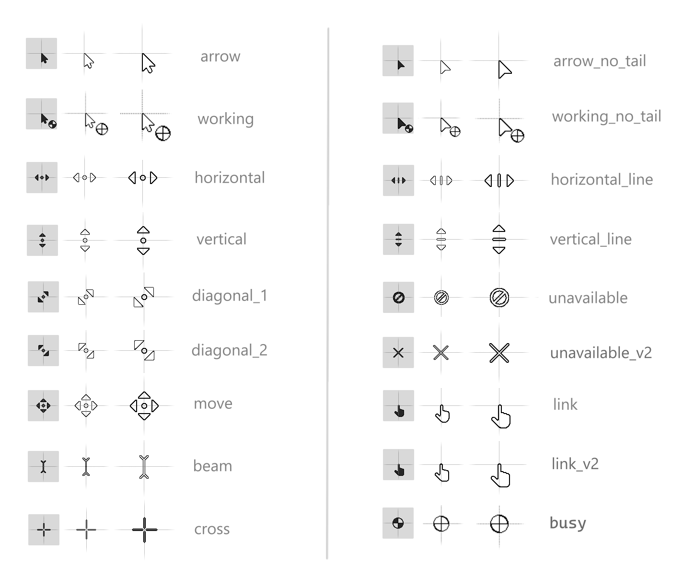 -->

<!-- 
 -->
<!-- 
List of all cursors
 -->
### Main cursor styles

|                             | Regular                                                        | No tail                                                      | Tail detached                                              |
|-----------------------------|----------------------------------------------------------------|---------------------------------------------------------------|-------------------------------------------------------------|
| `arrow`                     | 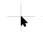  | 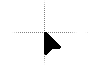  | 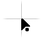  |
| `working`                   |  |  | 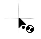 or 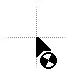 |
| `help`                      | 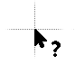   | 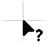   | 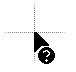   |

### Other cursors and their variants
| Cursor name                       | Image                                                           | Cursor name                       | Image                                                           |
|----------------------------|-----------------------------------------------------------------|----------------------------|-----------------------------------------------------------------|
 `beam`                    | 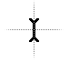       | `beam_v2`                       | 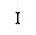          | 
 `busy`                      | 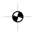         |  `cross`                      | 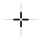         |
  `diagonal_1`                 | 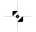    | `diagonal_2`                 | 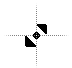 |
`horizontal`            | 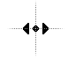 | `horizontal_v2`                 | 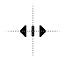    |
| `link`                    | 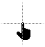      | `link_v2`                       | 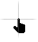          |
| `move`                   | 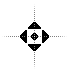     | `move_v2`                       |           |
| `pen`                        | 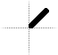          | `special`                    | 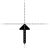       |
| `unavailable`             | 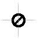 | `unavailable_v2`             | 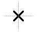|
| `unavailable_v3`                | 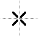  | `vertical`              | 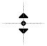 |
| `vertical_v2`                   | 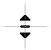 | `working_tail_detached`              |    

<!-- 
 -->

## How to install: 
1. Download the [latest release](https://www.patreon.com/emvaized/shop/modern-inverted-mouse-cursors-for-10-11-924356)
2. Extract downloaded .zip archive to any folder
3. Locate `cursors/Install.inf` file for "regular" or "no tail" style, right click on that `.inf` file and select "Install"
3. Open Control Panel and navigate to "Mouse Properties" > "Pointers"
4. Select the style you installed and click "Apply"
5. (optional) Double click any cursor type and select any other desired cursor from the extracted folder, if you want alternative version

## How to change specific cursors? 

In the same window (Control panel > Mouse Properties > Pointers) double click any type of the cursor, and then you can select the alternative version from the folder to which you have previously extracted the .zip archive. Some cursors have alternative design versions which you may prefer more!

## How to modify cursors? 
All cursors were created using [Realworld Cursor Editor](http://www.rw-designer.com/cursor-maker) — you can use this free tool to modify them for your needs! In order to draw an inverted cursor, you have to set your brush to use fully transparent white color (`00FFFFFF`), along with cursor's color depth set to anything other than the default 32-bit color depth.

Read more about the used color depth (1-bit)

Color inversion feature is not supported for regular 32-bit cursors (the ones most people use), it is possible only in 1-, 4-, 8- and 24-bit cursors. But this also leads to semitransparency not being available for us — all pixels in inverted cursors can then only be either fully opaque, transparent or inverted. That's why you may notice some chopiness on curves in this cursor pack (so called pixel ladders), especially when we need to show some circle shape.

At first I made these cursors 24-bit, but I noticed that in some apps (Microsoft Edge, Krita, CS2) in some occasions cursor suddenly stops inverting colors behind it and becomes all-white, with even black borders dissapearing. Maybe it's some videodrivers issue specific to my computer. But I found out that it doesn't happen if cursor is set to 1-bit mode (black and white) — cursor may still flicker in such situations, but it keeps showing black borders and remains clearly visible. 

Therefore I converted most of cursors in this pack to 1-bit color depth, and as an upside, their size is greatly smaller than regular version (2.19kbs per cursor compared to 22.9kbs), while they look and feel pretty much the same. Also, default inverted cursors in Windows are also 1-bit, so it's probably the best way to do it. However, in the future if we decide to add some colorful elements to cursors, and no longer stick to the current black'n'white design, it may be needed to increase the color depth.

## Support ❤️
If you really enjoy this project, please consider supporting its further development by making a small donation using one of the ways below! 

 &nbsp;  &nbsp; 