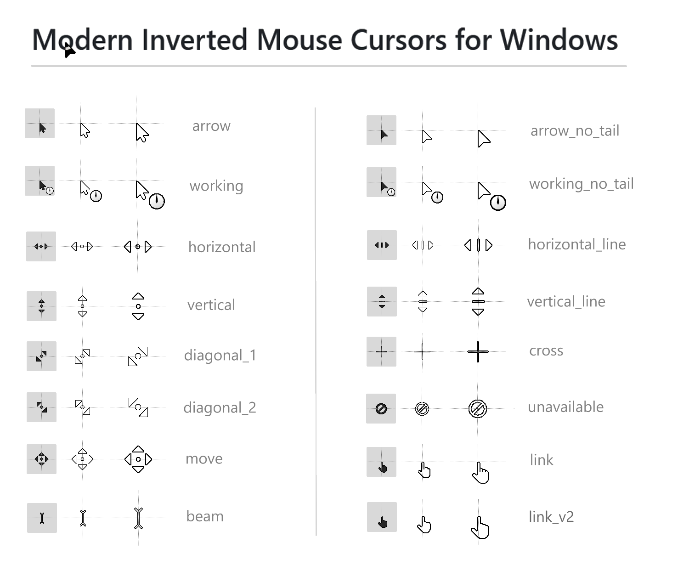

This project aims to recreate standard inverted mouse cursors with a more modern design. This cursor inverts the colors behind it, and this way it always stands out no matter the background. Although this feature was initially designed for people with vision problems, regular people could greatly benefit from it as well. Original inverted mouse cursors, available in Windows out the box, hasn't been updated for decades and look quite outdated as for now. This project intends to fix it by providing overhauled inverted mouse cursors. 

Design is mostly inspired by standard white mouse cursor in Windows 10/11, but few design changes were made to improve visibility specifically for inverted mouse cursors. 

---

### How to install: 
1. Click green button "Code" > "Download ZIP"
2. Extract downloaded .zip archive to any folder
3. Locate `cursors/Install.inf` file for "regular" or "no tail" style, right click on that `.inf` file and select "Install"
3. Open Control Panel and navigate to "Mouse Properties" > "Pointers"
4. Select the style you installed and click "Apply"
5. (optional) Double click any cursor type and select any other desired cursor from the extracted folder
