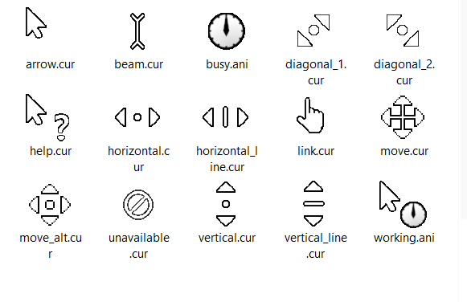

# Modern Inverted Mouse Cursors for Windows

This project aims to recreate standard inverted mouse cursors with a more modern design. Original inverted mouse cursors, available in Windows out the box, hasn't been updated for decades and look quite outdated as for now. This project intends to fix it by providing overhauled inverted mouse cursors. 

Design is mostly inspired by standard white mouse cursor in Windows 10/11, but few design changes were made to improve visibility specifically for inverted mouse cursors. 

---

### How to install: 
1. Click green button "Code" > "Download ZIP"
2. Extract downloaded .zip archive to any folder
3. Open Control Panel, and navigate to "Mouse Properties" > "Pointers"
4. Double click any cursor type and select the desired cursor from the extracted folder
